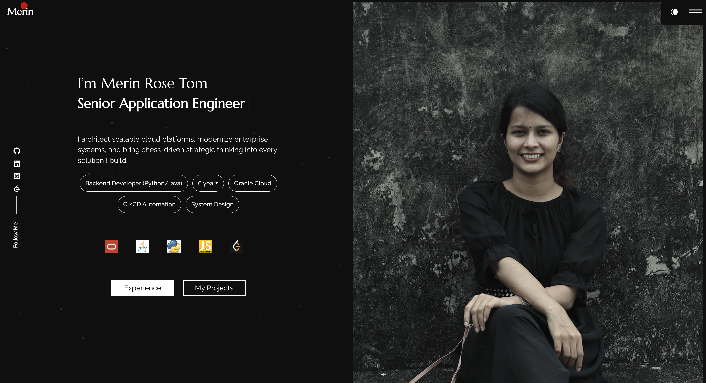

# React Portfolio Website

A modern, fully customizable portfolio website built with React. Perfect for developers, designers, and professionals to showcase their work and skills.



🌐 **Live Demo**: [https://merinrose123.github.io/merin-rose-tom/](https://merinrose123.github.io/merin-rose-tom/)

## ✨ Features

- **Modern Design**: Clean, professional layout with smooth animations
- **Responsive**: Works perfectly on desktop, tablet, and mobile
- **Dark Theme**: Beautiful dark color scheme
- **Interactive Elements**: Hover effects and smooth transitions
- **Multiple Sections**: Home, About, Experience, Projects, Skills, Blogs & Hobbies

## 🛠️ Tech Stack

- **React 18** - Frontend framework
- **React Router** - Navigation
- **Bootstrap** - Responsive components
- **CSS3** - Custom styling and animations
- **GitHub Pages** - Free hosting

## 📁 Project Structure

```
merin-rose-tom/
├── public/
│   ├── index.html
│   ├── manifest.json
│   └── robots.txt
├── src/
│   ├── assets/
│   │   └── images/          # Portfolio images and icons
│   ├── components/
│   │   └── themetoggle/     # Dark/light theme toggle
│   ├── content_option.js    # All portfolio content and data
│   ├── pages/
│   │   ├── home/            # Landing page with hero section
│   │   ├── about/           # Professional background & achievements
│   │   ├── experience/      # Career timeline & detailed experience
│   │   ├── portfolio/       # Projects & certifications showcase
│   │   ├── skills/          # Technical skills with progress bars
│   │   └── hobbies/         # Personal interests & technical blogs
│   ├── app/
│   │   ├── App.css          # Global styles
│   │   └── routes.js        # Application routing configuration
│   ├── hooks/               # Custom React hooks
│   ├── index.css            # Global CSS variables and resets
│   └── index.js             # Application entry point
├── package.json
├── README.md
└── yarn.lock
```

## 🎨 How to Customize

**Main file to edit: `src/content_option.js`**

This file contains all your personal information, projects, skills, and content. Simply update the values in this file to customize your portfolio.

### Key things to change:
- **Personal info**: name, title, bio, contact details
- **Projects**: add your projects with descriptions and skills used
- **Skills**: update technical skills and proficiency levels
- **Experience**: career timeline and detailed descriptions
- **Social links**: GitHub, LinkedIn, etc.
- **Images**: replace profile pic and project screenshots in `src/assets/images/`

### Advanced customization:
- **Colors**: Edit CSS variables in `src/index.css`
- **Styling**: Modify component styles in respective CSS files
- **Layout**: Add new sections by creating components in `src/pages/`

## 🚀 Getting Started

### Prerequisites
- **Node.js** (v14 or higher)
- **npm** or **yarn** package manager
- **Git** for version control

### Installation

1. **Clone the repository**
   ```bash
   git clone https://github.com/MerinRose123/merin-rose-tom.git
   cd merin-rose-tom
   ```

2. **Install dependencies**
   ```bash
   npm install
   # or
   yarn install
   ```

3. **Start development server**
   ```bash
   npm start
   # or
   yarn start
   ```

4. **Open browser**
   ```
   http://localhost:3000
   ```

### Build for Production

```bash
npm run build
# or
yarn build
```

### Deploy to GitHub Pages

```bash
npm run deploy
# or
yarn deploy
```

## � License

This project is licensed under the MIT License - see the [LICENSE](LICENSE) file for details.

---

⭐ **Star this repo** if you found it helpful! Feel free to fork and customize it for your own portfolio.
